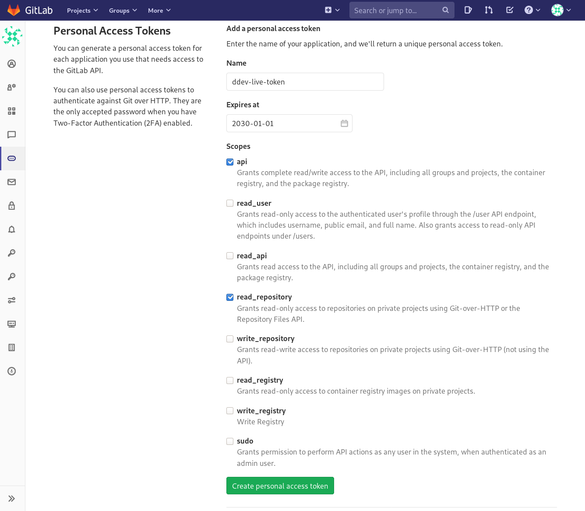
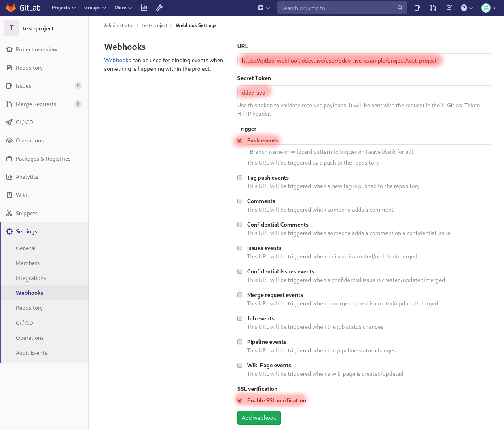

# GitLab

???+ note
    This guide uses GitLab 13.0 for its examples. Your experience may vary depending on GitLab version. Current functionality was designed with self-managed [GitLab Omnibus](https://about.gitlab.com/install/) in mind. [GitLab.com](https://gitlab.com/) may be used in the same way, however you will need to [manually configure webhooks](https://docs.ddev.com/gitlab/#project-webhook-configuration).


The integration with GitLab has been designed differently from [GitHub](https://docs.ddev.com/github/).  For publicly available GitLab repositories, [the CLI flags](https://docs.ddev.com/sites/#gitlab) are all you need. This page describes how to configure credentials and enable webhooks for automatic build triggers.

### Configure personal access token

Create GitLab personal access token and upload it to DDEV-Live to enable site builds from private repositories hosted on GitLab and automatic site builds.

**Create new personal access token**

1. Log in to GitLab. Note your username - it will be used later
2. Head over to `Settings` -> `Access Tokens`
3. Enter a token name, expiration date, and choose `Scopes`. The `read_repository` scope is required, and we optionally recommend the `api` scope for automatic [Project Webhook Configuration](#Project-Webhook-Configuration)
4. Click Create the personal access token
5. Copy the newly created personal access token



**Connect the personal access token to DDEV-Live**

Use the DDEV-Live CLI command to upload the token:
```
ddev-live create credentials gitlab <credentials-name> \
    --url=<gitlab-server-hostname> \
    --user=<username> \
    --token=<personal-access-token>
```

* `<credentials-name>` is the unique name of your personal access token in DDEV-Live. Must match `[a-z0-9]([-a-z0-9]*[a-z0-9])?` but does not need to be the same name as you provided to GitLab
* `<gitlab-server-hostname>` is the hostname of your GitLab server, eg. `https://gitlab.example.com`
* `<username>` is the username of the logged in user who created the personal access token in GitLab
* `<personal-access-token>` is the personal access token

### Site creation

[Site](https://docs.ddev.com/sites/) creation now uses the [ddev-live CLI more general purpose flags](https://docs.ddev.com/sites/#gitlab).

```
ddev-live create site typo3 typo3-example-site \
    --git-repo=https://gitlab.example.com/user/my-awesome-site \
    --git-rev=main \
    --run-composer-install \
    --typo3-version=10 \
    --docroot=public
```

### Project webhook configuration

If you've included the `api` scope when creating your personal access token in GitLab, the platform will automatically configure webhooks for each project at time of creation. You can check the status of the auto-configuration by running a CLI command to describe site details `$ ddev-live describe site <site-name>`.

If you did not include the `api` scope, and want the platform to automatically build and deploy your application, you'll need to configure the webhooks manually per project in your GitLab server. See Manual GitLab webhook configuration example below.

??? info "Manual GitLab webhook configuration example"
    

1. Login to your GitLab instance and go to a desired project `Settings` -> `Webhooks` page.
2. Using DDEV-Live CLI, run `$ ddev-live describe site <site-name>`, under the section `SITE IMAGE`, you can find `GIT SOURCE` and `Status`. This should contain a URL for the GitLab Webhook Settings and Secret Token.
3. Select `Push events` trigger, optionally you can restrict a branch as well, but you can keep that blank to forward events for all branches.
4. Check `Enable SSL verification` to keep the connection between GitLab and DDEV-Live secure.
5. Click on `Add webhook`.

#### Trigger site build manually

If you've opted out of webhooks all together, you will need to trigger site deployments manually,

```
$ ddev-live configure site --git-rev <sha/tag/branch>
```

will trigger a build if the git revision differs from previously configured revision.

### Revoke access

**Delete webhook configuration**

If you want to disable a webhook trigger, delete all sites that reference particular GitLab server.
List sites:
```
$ ddev-live list sites
```
Delete sites:
```
$ ddev-live delete site <site-name>
```
More on the DDEV-Live CLI interaction with the sites in [the sites section](https://docs.ddev.com/sites/#working-with-your-site-on-ddev-live).

**Revoke credentials**

Log in to GitLab and delete the personal access token.
Optionally delete the revoked token from DDEV-Live as well:
```
$ ddev-live delete credentials gitlab <credentials-name>
```
